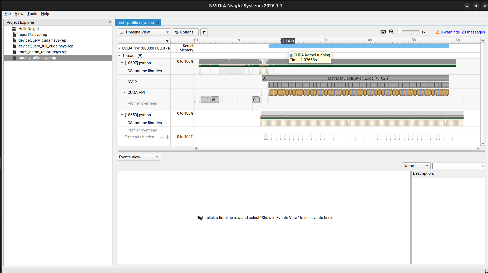

# NVIDIA Nsight Systems GPU Profiling Demo

## Quick Start

1. Create and activate virtual environment: `python3 -m venv venv && source venv/bin/activate`
2. Install dependencies: `pip install -r requirements.txt`
3. Profile with Nsight Systems: `nsys profile -o torch_profile python torch_demo.py`
4. View results: `nsys-ui torch_profile.nsys-rep` or open the `.nsys-rep` file in Nsight Systems GUI
5. Look for NVTX markers ("Data Initialization", "Matrix Multiplication Loop") in the timeline to track GPU performance

## Understanding the Profile

### Timeline Segments Explained

- **CUDA HW (Kernel)**: Blue bars show actual GPU compute activity - your matrix multiplications executing on the GPU hardware
- **NVTX**: Custom markers from your code - orange blocks are individual iterations, gray blocks show initialization phases
- **CUDA API**: Blue blocks represent CUDA API calls from CPU side, vertical lines are synchronization points where CPU waits for GPU
- **Python Threads**: Shows your main Python process and background threads handling the workload execution
