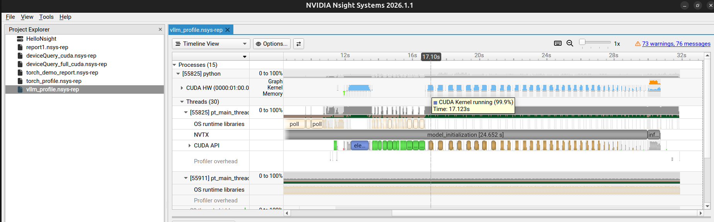
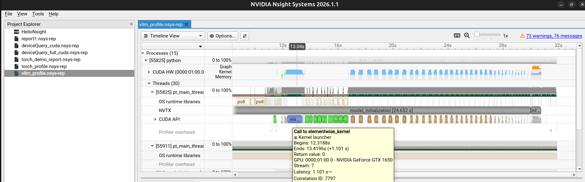

# vLLM + Nsight Systems

Simple vLLM model inference on GPU with Nsight Systems profiling.

## Setup
```bash
python3 -m venv venv
source venv/bin/activate
pip install -r requirements.txt
```

## Run

### 1. Test the script (regular run)
```bash
source venv/bin/activate
python3 vllm_demo.py
```

### 2. Profile with Nsight Systems
```bash
source venv/bin/activate
nsys profile -o vllm_profile --force-overwrite true python vllm_demo.py
```

### 3. View the profile
```bash
nsys-ui vllm_profile.nsys-rep
```

## What to expect in Nsight Systems

The profile will show:
- **NVTX ranges**: `model_initialization`, `inference`, `output_processing`
- **GPU utilization graph**: Blue graph showing GPU activity
- **CUDA API calls**: Memory allocations, kernel launches
- **CUDA kernels**: Individual GPU operations during inference

### Example Outputs


*Timeline showing NVTX ranges, CUDA API calls, and GPU activity*


*Detailed view of CUDA kernels and GPU utilization*

**Note:** Uses vLLM 0.6.3 which is compatible with CUDA 12.0
